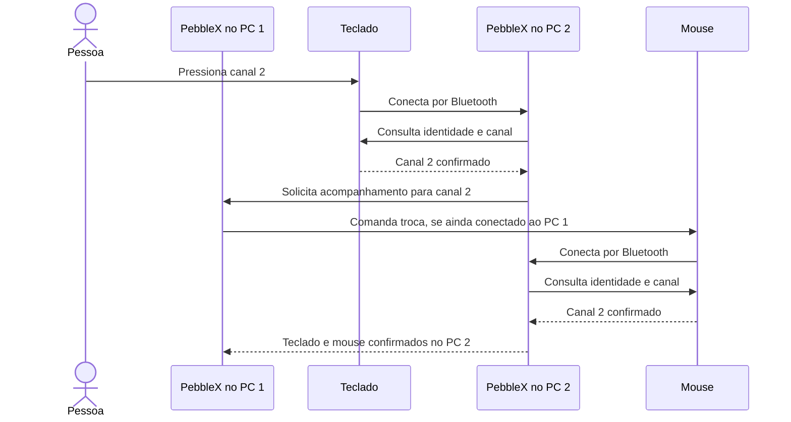

# Produto: mouse acompanha o teclado

## Objetivo acordado em 25/09/2026

O PebbleX roda nos aparelhos compatíveis da mesma rede local. O usuário escolhe o destino nos botões físicos Easy-Switch do teclado. O mouse acompanha essa escolha. Cada instalação mostra os computadores participantes e a localização confirmada dos periféricos.

O usuário decidiu usar os mesmos números de canal nos dois periféricos:

| Canal | Destino desejado |
| --- | --- |
| 1 | Windows do PC principal |
| 2 | Windows do PC secundário |
| 3 | Linux do PC secundário ou, ocasionalmente, telefone |

O mapa precisa ser conferido após o pareamento. Windows e Linux do PC secundário representam instalações distintas; a interface mostra como online somente a instalação que estiver respondendo. O uso alternado do canal 3 exige atualizar seu destino. O telefone depende de uma investigação de compatibilidade própria, incluindo acesso HID e execução em segundo plano.

## Comportamento

- O teclado é a origem das trocas automáticas. Mover o cursor entre monitores não dispara troca.
- Cada participante identifica os periféricos conectados localmente e comunica observações recentes aos pares vinculados.
- Uma transição confirmada do teclado para o canal N solicita que o mouse vá para N.
- Trocar o mouse pelo botão físico é uma intervenção manual. O PebbleX mostra os periféricos separados e não o força a retornar. A próxima transição confirmada do teclado pode disparar uma nova sincronização.
- Desativar a sincronização impede novos comandos e cancela os pedidos ainda não enviados. Um comando já entregue ao periférico pode terminar; a interface deve atualizar o resultado observado.
- Ao ativar com periféricos separados, mostrar a situação e oferecer uma ação explícita de alinhar agora. Não inventar uma transição do teclado a partir de uma observação antiga.
- Reiniciar um participante ou perder a rede exige confirmar novamente a localização dos periféricos. Estado antigo passa a desconhecido/offline e não provoca trocas.
- Um computador descoberto na rede só passa a participar depois de ser vinculado. Descoberta e vínculo Bluetooth são operações distintas.

## Fluxo implementado para validar entre dois Windows

A mensagem pela rede chega ao agente que ainda tem acesso ao mouse. O computador de destino não pode comandar diretamente uma interface Bluetooth que não está conectada a ele. A rede transporta estados e pedidos de canal; os periféricos continuam usando suas conexões Bluetooth com o sistema de destino.

A chegada/reconexão do teclado é o gatilho implementado; não depende de receber um evento antes da desconexão. O ciclo foi validado nos dois sentidos entre dois PCs Windows. As notificações analíticas D1/D2/D3 não são usadas como gatilho enquanto a entrega não for comprovada. O usuário observou atraso de aproximadamente 1–3 segundos; falta medir cada etapa e validar trocas rápidas, reconexões e retorno de suspensão.

## Interface desejada

- Computadores lado a lado, com nome, sistema, canal associado e estado online/offline.
- Um assistente que descobre computadores na rede, mostra candidatos e confirma o vínculo com código curto nas duas instalações. A configuração manual por ID/IP/chave permanece como alternativa.
- Indicadores independentes de teclado e mouse em cada computador, baseados em observações confirmadas.
- Controle **Sincronização ativada/desativada**, separado de **Captura de diagnóstico**.
- Estados de acompanhamento: desativada, aguardando teclado, transferindo mouse, sincronizados, separados manualmente e falha/estado desconhecido.
- **Sincronizados** significa ambos confirmados no mesmo destino. Enviar ou aceitar um comando não basta.
- O registro técnico permanece acessível para os testes, sem ocupar o lugar do painel de computadores.

## Entregas e critérios

1. Vínculo autenticado, descoberta automática e troca nos dois sentidos foram testados nos dois PCs Windows reais. A suíte local complementa, mas não substitui, esses testes de hardware.
2. Medir latência por etapa e validar trocas rápidas, suspensão, reinício, indisponibilidade de rede e encerramento do Flow durante uma transferência. Nunca repetir indefinidamente uma troca.
3. Completar presença online/offline e estado dos computadores/periféricos com observações recentes; o anúncio de descoberta atual não basta para confirmar o estado HID.
4. Adicionar o agente Linux e validar o cenário com inicialização alternada do PC secundário. Investigar suporte ao telefone separadamente antes de anunciá-lo como compatível.

## Situação atual

O código contém vínculo entre uma instalação e um par, com descoberta local, pareamento ECDH confirmado pelo usuário, chave protegida por DPAPI, transporte TCP autenticado e limitado, observação da chegada do teclado, comando do mouse no outro PC e confirmação depois da consulta HID no destino. O usuário confirmou em hardware a descoberta/pareamento automático e o ciclo Flow nos dois sentidos entre dois PCs Windows. Linux e telefone continuam fora deste marco.

A tela principal resume teclado e mouse; o modo desenvolvedor preserva captura, relatórios e controles manuais. O pareamento gera uma chave por sessão e salva em cada Windows; o Flow precisa estar ativado nos dois PCs. A descoberta usa UDP 47630 e o pareamento/Flow usa TCP 47631, que precisa estar acessível em cada direção. Com Flow ativo, fechar pelo X recolhe a janela para a área de notificação e mantém os listeners ativos; encerrar pelo menu do ícone desativa o Flow e fecha o processo.
